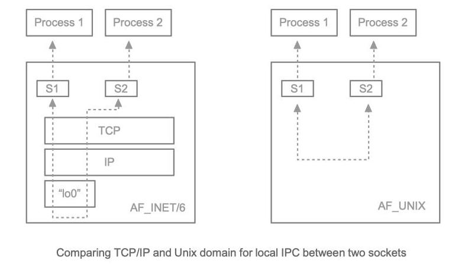

# Socket Programming

## Introduction

### TCP Implementation in Linux

#### Packet Reception
 

#### Packet Transmission


### Socket Structure in Kernel


### Socket Just an IPC mechanism


## Socket

- The term socket dates to the publication of RFC 147 in 1971, when it was used in the ARPANET.

### Berkeley Socket

- A **Berkeley** (BSD) socket is an application programming interface (API) for Internet domain sockets and Unix domain sockets, used for Inter-process Communication (**IPC**).

- It is commonly implemented as a library of linkable modules. It originated with the 4.2BSD Unix operating system, which was released in 1983.

- A Socket is an abstract representation (handle) for the local endpoint of a network communication path.

#### Berkeley(BSD) Sockets API in OSI model


### POSIX Socket

- Berkeley socket API evolved and ultimately yielded the **POSIX** socket API.

- Certain functions were deprecated or removed and replaced by others. 

- The **POSIX** API is also designed to be supports IPv6.

|Action 	|BSD 	|POSIX|
|:-:        |:-:    |:-:|
|Conversion from text address to packed address 	|`inet_aton` 	|`inet_pton`|
|Conversion from packed address to text address 	|`inet_ntoa` 	|`inet_ntop`|
|Forward lookup for host name/service 	|`gethostbyname`, `gethostbyaddr`, `getservbyname`, `getservbyport` 	|`getaddrinfo`|
|Reverse lookup for host name/service 	|`gethostbyaddr`, `getservbyport` 	|`getnameinfo`|


### Windows Socket (WinSock)

- **WinSock** is a version of the Berkeley socket interface for MS Windows.

- Windows Sockets API (WSA), later shortened to **Winsock**, is an application programming interface (API) that defines how Windows network application software should access network services, especially TCP/IP protocol stack.

#### Windows Socket (WinSock) API in OSI model


### Socket in OSI Layers


## Headers

|File 	|Description|
|:-:    |:-        |
|`sys/socket.h` 	|Core socket functions and data structures.|
|`netinet/in.h` 	|`AF_INET` and `AF_INET6` address families and their corresponding protocol families, `PF_INET` and `PF_INET6`. These include standard IP addresses and TCP and UDP port numbers.|
|`sys/un.h` 	|`PF_UNIX` and `PF_LOCAL` address family. Used for local communication between programs running on the same computer.|
|`arpa/inet.h `	|Functions for manipulating numeric IP addresses.|
|`netdb.h` 	|Functions for translating protocol names and host names into numeric addresses. Searches local data as well as name services.| 


## Structures

### Socket Descriptor

- In Linux/Unix, Everything is a **File**.

- Regular files, directories, and even devices are files. 

- Every file has an associated number called the file descriptor (FD).

- File descriptor is a non-negative integer that starts at 0. 

```c
#include <stdio.h>
#include <unistd.h>
#include <fcntl.h>

#define FILE_NAME "file.txt"

int main() {
    // Open the file
    int fd = open(FILE_NAME, O_RDONLY); 
    char buffer[256];
    // Read 256 bytes
    read(fd, buffer, 256);
    printf("%s [%s]\n", FILE_NAME, buffer);
    // Close the file
    close(fd); 
    return 0;
}
```

- Your terminal/console is a device, and therefore has a file descriptor associated with it (e.g. `stdin`=0, `stdout`=1, `stderr`=2).

```c
#include <stdio.h>
#include <unistd.h>

int main() {
    char buffer[256];
    printf("stdin: ");
    fflush(stdout);
    // Read 256 bytes from stdin
    read(0, buffer, 256);
    printf("buffer: [%s]\n", buffer);
    return 0;
}
```

- Socket Descriptor is also a file descriptor

- Point to a open socket

- Socket descriptor act as a handle of a socket.

- 2 Byte `int`

```c
#include <sys/types.h>
#include <sys/socket.h>

int main() {
    int sockfd;
    sockdf = socket(AF_INET, SOCK_STREAM, 0);
    
    /*
    ...
    */

    return 0;
}
```

### `sockaddr`

```c
struct sockaddr {
    unsigned short sa_family;   // Address family, AF_xxxx: 2 byte
    char sa_data[14]            // Protocol address: 14 byte
};
```

#### `sa_family`
specifies the protocol family of the created socket:  
- `AF_INET`: for internet network protocol IPv4 (IPv4-only)
- `AF_INET6`: for IPv6 (and in some cases, backward compatible with IPv4)
- `AF_UNIX`: for local socket (using a special filesystem node)
- `AF_APPLETALK`: for Appletalk protocol stack
- `AF_IPX`: for IPx protocol stack
- ...

#### `sa_data`
- 14 Byte array = `sin_port`(2B) + `sin_addr`(4B) + `sin_zero`(8B)

### `sockaddr_in`
```c
struct sockaddr_in {
    unsigned short sin_family;  // Address family: 2 byte
    unsigned short sin_port;    // Port number: 2 byte
    struct in_addr sin_addr;    // Internet address: 4 byte
    char sin_zero[8];           // To have same size as struct sockaddr: 8 byte
};
```

- `sockaddr` and `sockaddr_in` is same but `sockaddr_in` is better for socket address.

### `in_addr`

```c
struct in_addr {
    unsigned long s_addr;       // Internet ip address (a structure for historical reasons): 4 byte
}
```

### Address Family (AF)


### `hostent`

```c
struct hostent {
    char *h_name;               // Official name of host
    char **h_aliases;           // Alias list
    int h_addrtype;             // Host address type
    int h_length;               // Length of address
    char **h_addr_list;         // List of addresses from name server  
#define	h_addr h_addr_list[0]   // Address, for backward compatibility
};
```


## Structures Issues

### Endians

Little Endian and Big endian are two ways of storing multi-byte data-types (`int`, `float`, etc) in computers.

- **Little Endian (LE)**: Store the smallest part of a number first. (Intel x86)
- **Big Endian (BE)**: Store the biggest part of a number first. (Spark, Network)


```c
#include <stdio.h>

/*Function to show bytes in memory, from location start to start+n*/
void show_mem_rep(unsigned char *start, int size){
    for (int i = 0; i < size; i++) {
        printf(" %.2x", start[i]);
    }
    printf("\n");
}

/*Main function to call above function for 0x01234567*/
int main(){
    int num = 0x01234567;
    show_mem_rep((unsigned char *)&num, sizeof(num));
    return 0;
}
```

There is some function to convert **BE** to **LE** and vice versa.

|Function   |Stand for          |Action         |SYNOPSIS                               |
|:-:        |:-:                |:-:            |:-:                                    |
|`htons()`  |host to net short  |2 byte LE to BE|`uint16_t htons(uint16_t hostshort);`  |
|`htonl()`  |host to net long   |4 byte LE to BE|`uint32_t htonl(uint32_t hostlong);`   |
|`ntohs()`  |net to host short  |2 byte BE to LE|`uint16_t ntohs(uint16_t netshort);`   |
|`ntohl()`  |net to host long   |4 byte BE to LE|`uint32_t ntohl(uint32_t netlong);`    |


### IP String Format to Numeric Format

- We can't store `"192.168.11.121"` in `unsigned long s_addr`

#### `inet_addr()` / `inet_aton()`

##### SYNOPSIS
```c
#include <sys/socket.h>
#include <netinet/in.h>
#include <arpa/inet.h>

int inet_aton(const char *cp, struct in_addr *inp);
in_addr_t inet_addr(const char *cp);
```

##### DESCRIPTION
- Converts the Internet host address `cp` from IPv4  numbers-and-dots notation into binary data in network byte order.

- Convert IP string format to BE hex numeric format

##### EXAMPLES
```c
#include <sys/types.h>
#include <sys/socket.h>

int main() {
    int sockfd;
    struct sockaddr_in serveraddr;
    serveraddr.sin_family = AF_INET;
    serveraddr.sin_port = htons(port);
    serveraddr.sin_addr.s_addr = inet_addr("192.168.11.121");

    /*
    ...
    */

    return 0;
}
```
#### `inet_ntoa()`

##### SYNOPSIS
```c
#include <sys/socket.h>
#include <netinet/in.h>
#include <arpa/inet.h>

[[deprecated]] char *inet_ntoa(struct in_addr in);
```

##### DESCRIPTION
- Converts the Internet host address in, given in network byte order, to a string  in  IPv4  dotted-decimal  notation.

- Convert IP BE hex numeric format to string format

##### EXAMPLES
```c
#include <sys/types.h>
#include <sys/socket.h>

int main() {
    int sockfd;
    struct sockaddr_in serveraddr;
    serveraddr.sin_family = AF_INET;
    serveraddr.sin_port = htons(8080);
    serveraddr.sin_addr.s_addr = inet_addr("192.168.11.121");

    /*
    ...
    */

    char client_ip[] = inet_ntoa(clientaddr.sin_addr);
    printf("client ip: %s\n", client_ip);

    return 0;
}
```


## Connection-Oriented Socket (TCP) Connection Algorithm 


## Socket APIs


### `socket()`

#### SYNOPSIS
```c
#include <sys/socket.h>

int socket(int domain, int type, int protocol);
```

#### DESCRIPTION
Creates an endpoint for communication and returns a file descriptor that refers to that endpoint.

- `domain`: Specifies protocol family which will be used for communication
    - `AF_INET`: IPv4 Internet protocols    
    - `AF_INET6`: IPv6 Internet protocols
    - `AF_UNIX`: Local communication
    - `AF_LOCAL`: Synonym for `AF_UNIX`
    - `AF_APPLETALK`: AppleTalk
    - `AF_IPX`: IPX - Novell protocols
    - `AF_DECnet`: DECnet protocol sockets
    - ...

- `type`: Socket type specifies the communication semantics.
    - `SOCK_STREAM`: Provides sequenced, reliable, two-way, connection-based byte streams.
    - `SOCK_DGRAM`: Supports datagrams (connectionless, unreliable messages of a fixed maximum length).
    - `SOCK_RAW`: Provides raw network protocol access
    - ...   

- `protocol`: Specifies  a  particular  protocol  to  be used with the socket. (set to 0 for default protocol)

#### NOTES
+ Here you can see some socket example:

|Function                           |Socket layer   |Transport Layer Protocol   |Network Layer Protocol |Data-link Layer Protocol   |
|:-:                                |:-:            |:-:        |:-:        |:-:                    |
|`socket(AF_INET, SOCK_STREAM, 0)`  |L4 socket      |TCP        |IPv4       |?                      |
|`socket(AF_INET, SOCK_DGRAM, 0)`   |L4 socket      |UDP        |IPv4       |?                      |
|`socket(AF_UNIX, SOCK_STREAM, 0)`   |Local socket      |TCP        |-          |-                      |
|`socket(AF_INET, SOCK_RAW, ...)`   |L3 socket      |-          |IPv4       |?                      |
|`socket(AF_INET, SOCK_RAW, IPPROTO_ICMP)`   |L3 socket      |-        |ICMP/IPv4       |?                      |
|`socket(AF_INET6, SOCK_RAW, ...)`  |L3 socket      |-          |IPv6       |?                      |
|`socket(AF_IPX, SOCKRAW, ...)`     |L3 socket      |-          |IPX        |?                      |
|`socket(AF_PACKET, SOCK_RAW, ...)` |L2 socket      |-          |-          |Ethernet               |

+ **Unix Domain Socket Channels**


> `domain` is always `AF_INET` and `protocol` is always `0` for Ineternet Network Programming

+ Linux command to see open socket:
    - `ss -tln`: shows active TCP socket connections.
    - `ss -uln`: shows active UDP listening sockets.
    - `ss -wln`: shows listening raw sockets.


#### RETURN VALUE
- On success, a file descriptor for the new socket is returned. 
- On error, `-1` is returned, and `errno` is set to indicate the error.

#### EXAMPLES
```c
#include <stdio.h>
#include <stdlib.h>
#include <unistd.h>
#include <sys/types.h>
#include <sys/socket.h>
#include <arpa/inet.h>

int main() {
    int sockfd;
    sockfd = socket(AF_INET, SOCK_STREAM, 0);

    /*
    ...
    */

    return 0;
}
```

### `bind()`

#### SYNOPSIS
```c
#include <sys/socket.h>

int bind(int sockfd, const struct sockaddr *addr, socklen_t addrlen);
```

#### DESCRIPTION
Assigns the address specified by `addr` to the socket  referred to by the file descriptor `sockfd`.

- `sockfd`: Socket descriptor
- `addr`: Socket address (`sockaddr`)
- `addr_len`: Socket address lenght

#### NOTES
+ If port address is set to zero, operating system choose a random port between 1024 and 65535.

+ Don't choose port number between 0 and 1023, beacause this ports are for standard services.

+ If set the address field to `INADDR_ANY`, socket bind to all system ip address.

+ If choose used port `bind()` function failed.

#### RETURN VALUE
- On success, zero is returned.
- On error, `-1` is returned, and `errno` is set to indicate the error.

#### EXAMPLES
```c
#include <stdio.h>
#include <stdlib.h>
#include <unistd.h>
#include <sys/types.h>
#include <sys/socket.h>
#include <arpa/inet.h>

int main() {
    int sockfd;
    sockfd = socket(AF_INET, SOCK_STREAM, 0);

    struct sockaddr_in server_addr;
    memset(&server_addr, 0x00, sizeof(struct sockaddr_in));
    server_addr.sin_family = AF_INET;
    server_addr.sin_port = htons(8080);
    server_addr.sin_addr.s_addr = inet_addr("192.168.11.121");
    bind(sockfd, (struct sockaddr*)&server_addr, sizeof(struct sockaddr));

    /*
    ...
    */

    return 0;
}
```


### `listen()`

#### SYNOPSIS

```c
#include <sys/socket.h>

int listen(int sockfd, int backlog);
```

#### DESCRIPTION
Marks the socket referred to by `sockfd` as a passive socket, that is, as a socket that will be used to accept incoming connection requests

- `sockfd`: Socket descriptor
- `backlog`: Defines the maximum length to which the queue  of pending connections

#### NOTES
+ Based on `backlog` opened socket keep all requested connection in queue.

+ `netstat`: A linux command which show all open connections


#### RETURN VALUE
- On success, zero is returned.
- On error, `-1` is returned, and `errno` is set to indicate the error.

#### EXAMPLES
```c
#include <stdio.h>
#include <stdlib.h>
#include <unistd.h>
#include <sys/types.h>
#include <sys/socket.h>
#include <arpa/inet.h>

int main() {
    int sockfd;
    sockfd = socket(AF_INET, SOCK_STREAM, 0);

    struct sockaddr_in server_addr;
    memset(&server_addr, 0x00, sizeof(struct sockaddr_in));
    server_addr.sin_family = AF_INET;
    server_addr.sin_port = htons(8080);
    server_addr.sin_addr.s_addr = inet_addr("192.168.11.121");
    bind(sockfd, (struct sockaddr*)&server_addr, sizeof(struct sockaddr));

    listen(sockfd, 20);

    /*
    ...
    */

    return 0;
}
```

### `accept()`

#### SYNOPSIS
```c
#include <sys/socket.h>

int accept(int sockfd, struct sockaddr *addr, socklen_t *addrlen);
```

#### DESCRIPTION
Extracts the first connection request on the queue of pending connections for the listening socket, `sockfd`, creates a new connected socket, and returns a new file descriptor referring to that socket.

- `sockfd`: Socket that has been created with `socket()`
- `addr`: This structure is filled in with the address of the peer socket.
- `addrlen`: It to contain the size (in bytes) of the structure pointed to by `addr`

#### NOTES
+ In server side you must use socket descriptor which returned by `accepet()` in `send()` or `recv()`.

#### RETURN VALUE
- On success, these system calls return a file descriptor  for the accepted socket (a nonnegative integer).
- On error, `-1` is returned, `errno` is set to indicate the error, and addrlen is left unchanged.


#### EXAMPLES
```c
#include <stdio.h>
#include <stdlib.h>
#include <unistd.h>
#include <sys/types.h>
#include <sys/socket.h>
#include <arpa/inet.h>

int main() {
    int sockfd;
    sockfd = socket(AF_INET, SOCK_STREAM, 0);

    struct sockaddr_in server_addr;
    memset(&server_addr, 0x00, sizeof(struct sockaddr_in));
    server_addr.sin_family = AF_INET;
    server_addr.sin_port = htons(8080);
    server_addr.sin_addr.s_addr = inet_addr("192.168.11.121");
    bind(sockfd, (struct sockaddr*)&server_addr, sizeof(struct sockaddr));

    listen(sockfd, 20);

    int newfd;
    int client_addr_len;
    struct sockaddr_in client_addr;
    client_addr_len = sizeof(struct sockaddr_in);
    memset(&client_addr, 0x00, sizeof(struct sockaddr_in));
    newfd = accept(sockfd, &client_addr, &client_addr_len)

    /*
    ...
    */

    return 0;
}
```


### `connect()`

#### SYNOPSIS
```c
#include <sys/socket.h>

int connect(int sockfd, const struct sockaddr *addr, socklen_t addrlen);
```
#### DESCRIPTION
Connects the socket referred to by the file descriptor `sockfd` to the address specified by `addr`. 

- `sockfd`: Socket descriptor which created by `socket()`
- `addr`: Destination address want to connect to
- `addrlen`: Address lenght

#### NOTES
+ Operating System choose a random port for socket to connect

+ Client is connection starter so it must know server port


#### RETURN VALUE
- If  the connection or binding succeeds, zero is returned.
- On error, -1 is returned, and errno is set to indicate the error.

#### EXAMPLES
```c
#include <stdio.h>
#include <stdlib.h>
#include <unistd.h>
#include <sys/types.h>
#include <sys/socket.h>
#include <arpa/inet.h>

int main() {
    int sockfd;
    sockfd = socket(AF_INET, SOCK_STREAM, 0);

    struct sockaddr_in server_addr;
    memset(&server_addr, 0x00, sizeof(struct sockaddr_in));
    server_addr.sin_family = AF_INET;
    server_addr.sin_port = htons(8080);
    server_addr.sin_addr.s_addr = inet_addr("192.168.11.121");

    connect(sockfd, (struct sockaddr*)&server_addr, sizeof(struct sockaddr));

    /*
    ...
    */

    return 0;
}
```


### `close()`

#### SYNOPSIS
```c
#include <unistd.h>

int close(int fd);
```

#### DESCRIPTION
Closes a file descriptor, so that it no longer refers to any file and may be reused.

- `sockfd`: Socket descriptor which want to close

#### NOTES
+ If close `accept()` socket, that connection will be closed, but if close `socket()` socket all backlog connection will be closed.

+ If you didn't close the socket which bind to a port, that port will be opended.

#### RETURN VALUE
- On success returns zero.
- On error, `-1` is returned, and `errno` is set to indicate the error.

#### EXAMPLES
```c
#include <stdio.h>
#include <stdlib.h>
#include <unistd.h>
#include <sys/types.h>
#include <sys/socket.h>
#include <arpa/inet.h>

int main() {
    int sockfd;
    sockfd = socket(AF_INET, SOCK_STREAM, 0);

    struct sockaddr_in server_addr;
    memset(&server_addr, 0x00, sizeof(struct sockaddr_in));
    server_addr.sin_family = AF_INET;
    server_addr.sin_port = htons(8080);
    server_addr.sin_addr.s_addr = inet_addr("192.168.11.121");
    bind(sockfd, (struct sockaddr*)&server_addr, sizeof(struct sockaddr));

    listen(sockfd, 20);

    int newfd;
    int client_addr_len;
    struct sockaddr_in client_addr;
    client_addr_len = sizeof(struct sockaddr_in);
    memset(&client_addr, 0x00, sizeof(struct sockaddr_in));
    newfd = accept(sockfd, &client_addr, &client_addr_len)

    char message[] = "Hello World";
    send(newfd, message, strlen(message), 0);

    close(newfd);
    close(sockfd);

    /*
    ...
    */

    return 0;
}
```

```c
#include <stdio.h>
#include <stdlib.h>
#include <unistd.h>
#include <sys/types.h>
#include <sys/socket.h>
#include <arpa/inet.h>

int main() {
    int sockfd;
    sockfd = socket(AF_INET, SOCK_STREAM, 0);

    struct sockaddr_in server_addr;
    memset(&server_addr, 0x00, sizeof(struct sockaddr_in));
    server_addr.sin_family = AF_INET;
    server_addr.sin_port = htons(8080);
    server_addr.sin_addr.s_addr = inet_addr("192.168.11.121");

    connect(sockfd, (struct sockaddr*)&server_addr, sizeof(struct sockaddr));

    char message[] = "Hello World";
    send(sockfd, message, strlen(message), 0);

    close(sockfd);

    /*
    ...
    */

    return 0;
}
```


### `shutdown()`

#### SYNOPSIS
```c
#include <sys/socket.h>

int shutdown(int sockfd, int how);
```

#### DESCRIPTION
Close all or part of a full-duplex connection on the socket associated with sockfd.

- `sockfd`: Socket descriptor which want to close.
- `how`: Socket closing method
    - `SHUT_RD`(`0`): Further receptions will be disallowed.
    - `SHUT_WR`(`1`): Further transmissions will be disallowed.
    - `SHUT_RDWR`(`2`): Further receptions and transmissions will be disallowed. its like `close()`

#### RETURN VALUE
- On success, zero is returned.
- On error, `-1` is returned, and `errno` is set to indicate the error.

#### EXAMPLES
```c
#include <stdio.h>
#include <stdlib.h>
#include <unistd.h>
#include <sys/types.h>
#include <sys/socket.h>
#include <arpa/inet.h>

int main() {
    int sockfd;
    sockfd = socket(AF_INET, SOCK_DGRAM, 0);

    struct sockaddr_in server_addr;
    memset(&server_addr, 0x00, sizeof(struct sockaddr_in));
    server_addr.sin_family = AF_INET;
    server_addr.sin_port = htons(8080);
    server_addr.sin_addr.s_addr = inet_addr("192.168.11.121");
    int server_addr_len;
    server_addr_len = sizeof(struct sockaddr_in);

    char message[] = "Hello World";
    sendto(sockfd, message, strlen(message), 0, (const struct sockaddr *)&server_addr, server_addr_len);

    shutdown(sockfd, SHUT_RDWR);
    
    /*
    ...
    */

    return 0;
}
```


### `send()`

#### SYNOPSIS
```c
#include <sys/socket.h>

ssize_t send(int sockfd, const void* buf, size_t len, int flags);
```

#### DESCRIPTION
Transmit a message to another socket.

- `sockfd`: Socket descriptor of the sending socket.
- `buf`: Part of memory which store sent packet data.
- `len`: Buffer data lenght
- `flags`: Set it to zero

#### NOTES
+ Used in `SOCK_STREAM` sockets.

+ The only difference between `send()` and `write()`  is  the presence of flags. With a zero flags argument, `send()` is equivalent to `write()`

+ The number of bytes sent (return value) may not be the same as `len` value.

+ Best practice to send 1KB of data in each `send()`

#### RETURN VALUE
- On  success, these calls return the number of bytes sent.
- On error, `-1` is returned, and `errno` is set to indicate the error.

#### EXAMPLES
```c
#include <stdio.h>
#include <stdlib.h>
#include <unistd.h>
#include <sys/types.h>
#include <sys/socket.h>
#include <arpa/inet.h>

int main() {
    int sockfd;
    sockfd = socket(AF_INET, SOCK_STREAM, 0);

    struct sockaddr_in server_addr;
    memset(&server_addr, 0x00, sizeof(struct sockaddr_in));
    server_addr.sin_family = AF_INET;
    server_addr.sin_port = htons(8080);
    server_addr.sin_addr.s_addr = inet_addr("192.168.11.121");
    bind(sockfd, (struct sockaddr*)&server_addr, sizeof(struct sockaddr));

    listen(sockfd, 20);

    int newfd;
    int client_addr_len;
    struct sockaddr_in client_addr;
    client_addr_len = sizeof(struct sockaddr_in);
    memset(&client_addr, 0x00, sizeof(struct sockaddr_in));
    newfd = accept(sockfd, &client_addr, &client_addr_len)

    char message[] = "Hello World";
    send(newfd, message, strlen(message), 0);

    /*
    ...
    */

    return 0;
}
```


### `recv()`

#### SYNOPSIS
```c
#include <sys/socket.h>

ssize_t recv(int sockfd, void* buf, size_t len, int flags);
```

#### DESCRIPTION
Receive messages from a socket.

- `sockfd`: Socket descriptor of the receiving socket.
- `buf`: Part of memory which store recvied packet data.
- `len`: Buffered data lenght.
- `flags`: Set it to zero.

#### NOTES
+ Used in `SOCK_STREAM` sockets.

+ The only difference between `recv()` and `read()` is the presence of flags. With a zero flags argument, `recv()` is generally equivalent to `read()`.

+ The number of bytes received (return value) may not be the same as `len` value.

+ **Kernel buffering**


#### RETURN VALUE
- On  success, these calls return the number of bytes sent.
- On error, `-1` is returned, and `errno` is set to indicate the error.

#### EXAMPLES
```c
#include <stdio.h>
#include <stdlib.h>
#include <unistd.h>
#include <sys/types.h>
#include <sys/socket.h>
#include <arpa/inet.h>

int main() {
    int sockfd;
    sockfd = socket(AF_INET, SOCK_STREAM, 0);

    struct sockaddr_in server_addr;
    memset(&server_addr, 0x00, sizeof(struct sockaddr_in));
    server_addr.sin_family = AF_INET;
    server_addr.sin_port = htons(8080);
    server_addr.sin_addr.s_addr = inet_addr("192.168.11.121");
    bind(sockfd, (struct sockaddr*)&server_addr, sizeof(struct sockaddr));

    listen(sockfd, 20);

    int newfd;
    int client_addr_len;
    struct sockaddr_in client_addr;
    client_addr_len = sizeof(struct sockaddr_in);
    memset(&client_addr, 0x00, sizeof(struct sockaddr_in));
    newfd = accept(sockfd, &client_addr, &client_addr_len)

    char buffer[1024];
    memset(buffer, 0x00, 1024);
    read(newfd, buffer, 1024);

    /*
    ...
    */

    return 0;
}
```


### `sendto()`
#### SYNOPSIS
```c
#include <sys/socket.h>

ssize_t sendto(int sockfd, const void *buf, size_t len, int flags, const struct sockaddr *dest_addr, socklen_t addrlen);
```

#### DESCRIPTION
- `sockfd`: Socket descriptor of the sending socket.
- `buf`: Part of memory which store sent packet data.
- `len`: Buffer data lenght
- `flags`: Set it to zero
- `dest_addr`: Destination address
- `addrlen`: Destination address lenght

#### NOTES
+ Used in `SOCK_DGRAM` sockets.

+ `send(sockfd, buf, len, flags);` = `sendto(sockfd, buf, len, flags, NULL, 0);`

+ The number of bytes sent (return value) may not be the same as `len` value.

+ Best practice to send 1KB of data in each `sendto()`


#### RETURN VALUE
- On  success, these calls return the number of bytes sent.
- On error, `-1` is returned, and `errno` is set to indicate the error.

#### EXAMPLES
```c
#include <stdio.h>
#include <stdlib.h>
#include <unistd.h>
#include <sys/types.h>
#include <sys/socket.h>
#include <arpa/inet.h>

int main() {
    int sockfd;
    sockfd = socket(AF_INET, SOCK_DGRAM, 0);

    struct sockaddr_in server_addr;
    memset(&server_addr, 0x00, sizeof(struct sockaddr_in));
    server_addr.sin_family = AF_INET;
    server_addr.sin_port = htons(8080);
    server_addr.sin_addr.s_addr = INADDR_ANY;
    bind(sockfd, (struct sockaddr*)&server_addr, sizeof(struct sockaddr));

    struct sockaddr_in client_addr;
    int client_addr_len;
    client_addr_len = sizeof(struct sockaddr_in);

    char message[] = "Hello World";
    sendto(sockfd, message, strlen(message), 0, (const struct sockaddr *)&client_addr, client_addr_len);

    /*
    ...
    */

    return 0;
}
```


### `recvfrom()`

#### SYNOPSIS
```c
#include <sys/socket.h>

ssize_t recvfrom(int sockfd, void* buf, size_t len, int flags, struct sockaddr* src_addr, socklen_t* addrlen);
```

#### DESCRIPTION
- `sockfd`: Socket descriptor of the receiving socket.
- `buf`: Part of memory which store recvied packet data.
- `len`: Buffered data lenght.
- `flags`: Set it to zero.
- `src_addr`: Source address.
- `addrlen`: Source address lenght.

#### NOTES
+ Used in `SOCK_DGRAM` sockets.

+ `recv(sockfd, buf, len, flags);` = `recvfrom(sockfd, buf, len, flags, NULL, NULL);`

+ The number of bytes received (return value) may not be the same as `len` value.

#### RETURN VALUE
- On  success, these calls return the number of bytes sent.
- On error, `-1` is returned, and `errno` is set to indicate the error.

#### EXAMPLES
```c
#include <stdio.h>
#include <stdlib.h>
#include <unistd.h>
#include <sys/types.h>
#include <sys/socket.h>
#include <arpa/inet.h>

int main() {
    int sockfd;
    sockfd = socket(AF_INET, SOCK_DGRAM, 0);

    struct sockaddr_in server_addr;
    memset(&server_addr, 0x00, sizeof(struct sockaddr_in));
    server_addr.sin_family = AF_INET;
    server_addr.sin_port = htons(8080);
    server_addr.sin_addr.s_addr = INADDR_ANY;
    bind(sockfd, (struct sockaddr*)&server_addr, sizeof(struct sockaddr));

    struct sockaddr_in client_addr;
    int client_addr_len;
    client_addr_len = sizeof(struct sockaddr_in);

    char buffer[1024];
    memset(buffer, 0x00, 1024);
    recvfrom(sockfd, buffer, 1024, 0, (struct sockaddr *)&client_addr, &client_addr_len);

    /*
    ...
    */

    return 0;
}
```


### `getpeername()`

#### SYNOPSIS
```c
#include <sys/socket.h>

int getpeername(int sockfd, struct sockaddr *addr, int *addrlen);
```

#### DESCRIPTION
Returns the address of the peer connected to the socket `sockfd`, in the buffer pointed to by `addr`.

- `sockfd`: Socket descriptor.
- `addr`: Fill it with peer address.
- `addrlen`: Address lenght.

#### NOTES
+ On return it contains the actual size of the name returned (in bytes).

+ The name is truncated if the buffer provided is too small.

#### RETURN VALUE
- On success, zero is returned.  
- On error, `-1` is returned, and `errno` is set to indicate the error.

#### EXAMPLES
```c
#include <stdio.h>
#include <stdlib.h>
#include <unistd.h>
#include <sys/types.h>
#include <sys/socket.h>
#include <arpa/inet.h>

int main() {
    int sockfd;
    sockfd = socket(AF_INET, SOCK_STREAM, 0);

    struct sockaddr_in server_addr;
    memset(&server_addr, 0x00, sizeof(struct sockaddr_in));
    server_addr.sin_family = AF_INET;
    server_addr.sin_port = htons(8080);
    server_addr.sin_addr.s_addr = inet_addr("192.168.11.121");

    connect(sockfd, (struct sockaddr*)&server_addr, sizeof(struct sockaddr));

    struct sockaddr_in peer_addr;
    memset(&peer_addr, 0x00, sizeof(struct sockaddr_in));
    getpeername(sockfd, &peer_addr, sizeof(struct sockaddr_in));

    /*
    ...
    */

    return 0;
}
```


### `gethostname()`
#### SYNOPSIS
```c
#include <unistd.h>

int gethostname(char *name, size_t len);
```

#### DESCRIPTION
Returns the null-terminated hostname in the character array name, which has a length of `len` bytes.

- `name`: Fill it with hostname
- `len`: Hostname lenght

#### RETURN VALUE
- On success, zero is returned.  
- On error, `-1` is returned, and `errno` is set to indicate the error.

#### EXAMPLES
```c
#include <unistd.h>
#include <stdio.h>

int main() {
    size_t len = 255;
    char hostname[len];

    gethostname(hostname, len);
    printf("hostname: %s\n", hostname);

    return 0;
}
```


### `gethostbyname()`
#### SYNOPSIS
```c
#include <netdb.h>

struct hostent *gethostbyname(const char *name);
```

#### DESCRIPTION
Returns a structure of type hostent for the given host name.

- `name`: hostname or an IPv4 address in standard dot notation

#### NOTES
+ All hostname addresses store in `h_addr_list`.

+ Any address store in 4 byte of `h_addr_list` in network format. 

#### RETURN VALUE
- Return the `hostent` structure or a null pointer if an error occurs.  

- On error, the `h_errno` variable holds an error number.

#### EXAMPLES
```c
#include <stdio.h>
#include <netdb.h>
#include <stdlib.h>
#include <netinet/in.h>
#include <arpa/inet.h>

int main(int argc, char *argv[]) {
    struct hostent *h;
    
    if (argc != 2) {
        fprintf(stderr, "Usage: %s [domain]\n", argv[0]);
        return EXIT_FAILURE;
    }

    h = gethostbyname(argv[1]);
    if (h == NULL) {
        herror("gethostbyname");
        return EXIT_FAILURE;
    }

    printf("Hostname: %s\n", h->h_name);
    printf("IP Address: %s\n", inet_ntoa(*(struct in_addr*)(h->h_addr)));

    return EXIT_SUCCESS;
}
```


## TCP Socket


## UDP Socket


## Socket Usage
Here a example of using socket in Bitcoin project ([sock.cpp](https://github.com/bitcoin/bitcoin/blob/master/src/util/sock.cpp))


## Blocking and Non-blocking


## Socket programming using the select system call


## Example of Socket connection in HTTP
